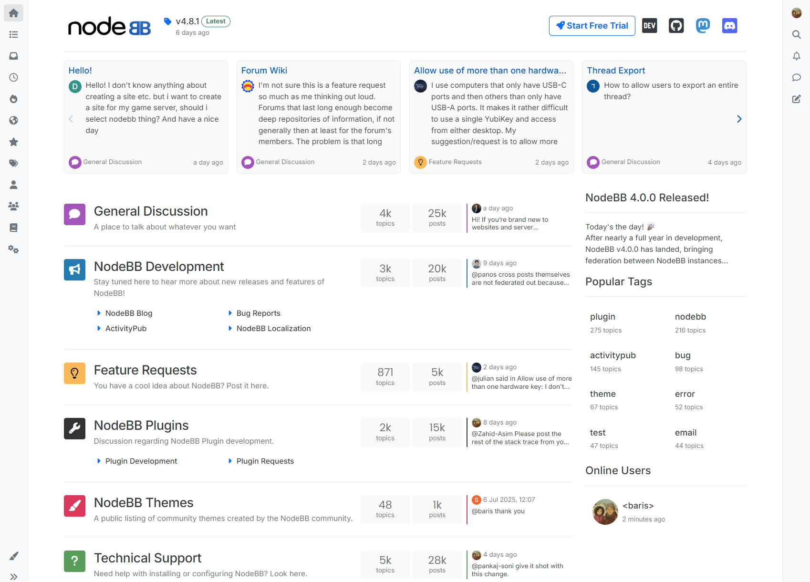
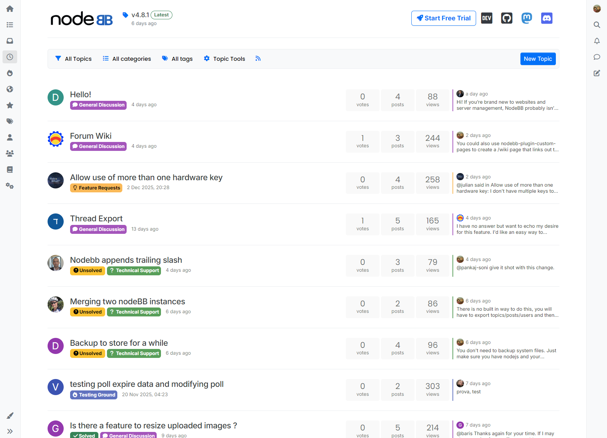
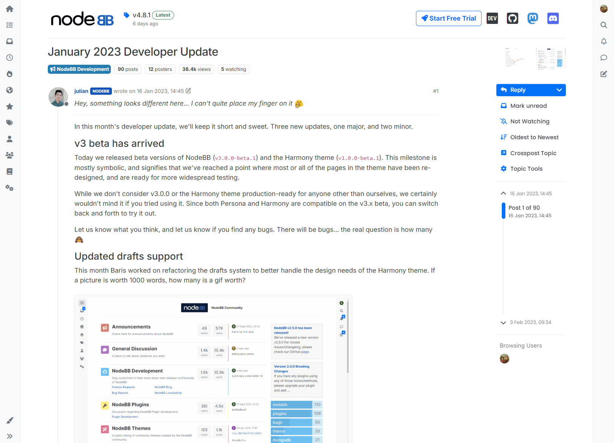

Harmony theme for NodeBB
====================

The Harmony theme is the default theme for NodeBB for versions spanning v3.0.0 onwards.

## Issues

Issues are tracked in [the main project issue tracker](https://github.com/NodeBB/NodeBB/issues?q=is%3Aopen+is%3Aissue+label%3Athemes).

## Screenshots

### Categories

_The cards in the header are added by the recent cards plugin. https://github.com/NodeBB-Community/nodebb-plugin-recent-cards_

### Recent

### Topic

